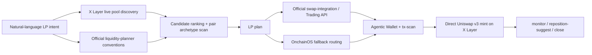

# Uniswap LP Intent Compiler

`Uniswap LP Intent Compiler` is a reusable X Layer LP orchestrator built on top of official Uniswap AI Skills.  
`Uniswap LP Intent Compiler` 是一个基于 Uniswap 官方 AI Skills 构建的、面向 X Layer 的可复用 LP 编排技能。

## Overview | 项目简介

It keeps natural language as the primary interface, then turns LP intent into:  
它以自然语言为主入口，并把 LP 意图编译成以下能力：

- live X Layer pool discovery / 实时发现 X Layer 可用池子
- ranked LP candidates / 输出排序后的 LP 候选列表
- official-skill-aligned range and fee planning / 基于官方 skill 约定生成区间与费率规划
- Agentic Wallet execution with `tx-scan` / 通过 Agentic Wallet 和 `tx-scan` 执行链上操作
- post-open monitoring and reposition suggestions / 开仓后的监控与 reposition 建议
- explicit LP close flows / 显式的 LP 关闭与撤流流程

## Quick Start | 快速开始

If you want the fastest local verification path, use this 3-step flow.  
如果你想走最快的本地验证路径，直接按这 3 步执行：

1. Create your local env from the template.  
   先根据模板创建本地环境文件。

```bash
cp .env.example .env
```

2. Install dependencies.  
   安装依赖。

```bash
npm install
```

3. Run preflight.  
   运行 preflight 检查。

```bash
npm run preflight
```

If `ready: true` is returned, you can move on to candidate discovery, LP planning, open, monitor, reposition suggestion, and close flows.  
如果返回 `ready: true`，就可以继续执行候选搜索、LP 规划、开仓、监控、reposition 建议和 close 流程。

## Prize Positioning | 奖项定位

This project is intentionally optimized for **Best Uniswap Integration**.  
这个项目是明确按 **Best Uniswap Integration** 奖项方向设计的。

- official `liquidity-planner` drives pair archetypes, fee guidance, and range guidance  
  官方 `liquidity-planner` 负责交易对类型、费率建议和区间规划约定
- official `swap-integration` drives Trading API request shaping and swap-routing behavior  
  官方 `swap-integration` 负责 Trading API 请求结构和 swap 路由约定
- `uniswap-lp-intent-compiler` adds X Layer-specific discovery, ranking, wallet execution, monitoring, and LP close logic  
  `uniswap-lp-intent-compiler` 补齐 X Layer 专属的发现、排序、钱包执行、监控和 LP close 逻辑

## Prerequisites | 前置条件

- official skill: `$CODEX_HOME/skills/uniswap/liquidity-planner/SKILL.md`
- official skill: `$CODEX_HOME/skills/uniswap/swap-integration/SKILL.md`
- `onchainos` CLI installed / 已安装 `onchainos` CLI
- Agentic Wallet logged in / Agentic Wallet 已登录
- workspace `.env` with `OKX_API_KEY`, `OKX_SECRET_KEY`, `OKX_PASSPHRASE`
- `UNISWAP_API_KEY` for `official-skills-hybrid` prize mode / `official-skills-hybrid` 奖项模式需要 `UNISWAP_API_KEY`

## Credential Setup | 凭证获取

Use `.env.example` as the template for your local `.env`.  
请以 `.env.example` 作为本地 `.env` 模板。

- `OKX_API_KEY` / `OKX_SECRET_KEY` / `OKX_PASSPHRASE`
  - Get them from the [OKX OnchainOS Dev Portal](https://web3.okx.com/onchainos/dev-portal)
  - 通过 OKX OnchainOS Dev Portal 获取
- Agentic Wallet setup and login
  - Follow the official [Agentic Wallet setup guide](https://web3.okx.com/onchainos/dev-docs/wallet/install-your-agentic-wallet)
  - 按照官方 Agentic Wallet 安装与登录指南配置
- `UNISWAP_API_KEY`
  - Create it via the Uniswap Developer Portal as described in the official API docs:
    - [Uniswap API Introduction](https://api-docs.uniswap.org/introduction)
    - [Uniswap API FAQs](https://api-docs.uniswap.org/guides/faqs)
  - 按照 Uniswap 官方 API 文档中的 Developer Portal 指引申请

Recommended supporting docs | 推荐辅助文档：

- [OnchainOS LLM docs](https://web3.okx.com/llms.txt)
- [Uniswap API integration guide](https://api-docs.uniswap.org/guides/integration_guide)

Run preflight before the demo.  
演示前请先运行 preflight：

```bash
npm run lp -- preflight
```

When preflight passes, it returns `capabilityPrompts`: a ready-to-use natural-language capability menu.  
当 preflight 通过后，会返回 `capabilityPrompts`，也就是可直接使用的自然语言能力菜单。

## Install As A Global Skill | 作为全局 Skill 安装

To install this as a reusable Codex or OpenClaw-style skill, copy the portable skill package:  
如果要把它作为可复用的 Codex 或 OpenClaw 风格 skill 安装，请复制这个可移植 skill 包：

```text
./skills/uniswap-lp-intent-compiler
```

into:  
复制到：

```text
$CODEX_HOME/skills/uniswap-lp-intent-compiler
```

Typical target paths:  
常见目标路径示例：

```text
Windows: %USERPROFILE%\.codex\skills\uniswap-lp-intent-compiler
macOS/Linux: ~/.codex/skills/uniswap-lp-intent-compiler
```

After copying:  
复制后请执行：

1. Keep `SKILL.md`, `package.json`, `tsconfig.json`, `agents/`, `scripts/`, `references/`, and optionally `dist/`.  
   保留 `SKILL.md`、`package.json`、`tsconfig.json`、`agents/`、`scripts/`、`references/`，以及可选的 `dist/`
2. Do not copy `node_modules/` from another workspace.  
   不要从别的工作区直接复制 `node_modules/`
3. Run `npm install` inside the installed skill directory.  
   在安装后的 skill 目录里执行 `npm install`
4. Run `npm run preflight` to verify readiness.  
   执行 `npm run preflight` 验证可用性
5. If Codex was already open, restart the session so the skill list refreshes.  
   如果 Codex 已经打开，重开会话以刷新 skill 列表

If dependencies are missing, the launcher stops with remediation text instead of failing silently.  
如果缺少依赖，启动器会直接输出 remediation 提示，而不是静默失败。

## Multi-Agent Adapters | 多 Agent 适配

This repository ships one reusable runtime plus thin adapter layers for mainstream agent tools.  
这个仓库维护一套可复用运行时，再为主流 agent 工具提供轻量适配层。

- Codex:
  - use `skills/uniswap-lp-intent-compiler/`
  - install into `$CODEX_HOME/skills/uniswap-lp-intent-compiler`
- Claude Code:
  - use `CLAUDE.md` for project memory
  - use `.claude/skills/uniswap-lp-intent-compiler/` for the project skill
  - use `.claude/agents/uniswap-lp-orchestrator.md` for the optional subagent
  - use `.claude/commands/` for optional command wrappers
- OpenClaw-style `SKILL.md` loaders:
  - reuse `skills/uniswap-lp-intent-compiler/` as the portable skill package

## Deployment | 部署信息

This project is delivered as a reusable agent skill package rather than a traditional hosted web app.  
这个项目的交付形态是可复用 agent skill 包，而不是传统的托管网页应用。

- GitHub repository / GitHub 仓库地址:
  - (https://github.com/afengshang/Uniswap-LP-Intent-Compiler)
- Primary delivery format / 主要交付形式:
  - reusable X Layer LP agent skill package / 可复用的 X Layer LP agent skill 包
- Public web app / 公开网页地址:
  - not required for this submission / 本次提交不依赖公开网页应用
- Codex install target / Codex 安装目标:
  - `$CODEX_HOME/skills/uniswap-lp-intent-compiler`
- OpenClaw-style install target / OpenClaw 风格安装目标:
  - `<agent-skill-dir>/uniswap-lp-intent-compiler`
- Claude Code delivery / Claude Code 交付方式:
  - repository-local `CLAUDE.md` + `.claude/` adapters / 仓库内置 `CLAUDE.md` + `.claude/` 适配层

## Skill Usage | OnchainOS / Uniswap Skill 使用情况

This project explicitly composes official Uniswap skills with OnchainOS execution and safety workflows.  
这个项目明确将官方 Uniswap skills 与 OnchainOS 的执行和安全工作流组合在一起。

- Official Uniswap `liquidity-planner`
  - used for pair archetypes, fee guidance, and range-planning conventions
  - 用于交易对类型、费率建议和区间规划约定
- Official Uniswap `swap-integration`
  - used for Trading API request-shaping and swap-routing conventions
  - 用于 Trading API 请求结构和 swap 路由约定
- OnchainOS / Agentic Wallet
  - used for wallet readiness, credential-backed execution, tx-scan guardrails, and contract-call flow
  - 用于钱包可用性检查、基于凭证的执行、tx-scan 安全护栏和合约调用流程
- Project runtime `uniswap-lp-intent-compiler`
  - adds X Layer pool discovery, candidate ranking, LP planning, monitoring, reposition suggestion, and close orchestration
  - 补齐 X Layer 池子发现、候选排序、LP 规划、监控、reposition 建议和 close 编排

## Team | 团队成员

- 王权 - CEO - afengshang95@gmail.com

## Supported / Not Supported | 支持范围 / 暂不支持

Supported now | 当前支持：

- X Layer only / 当前仅支持 X Layer
- live LP candidate discovery and ranking / 实时 LP 候选发现与排序
- LP plan compilation from natural language / 从自然语言生成 LP 建仓计划
- LP open with Agentic Wallet guardrails / 通过 Agentic Wallet 护栏执行开仓
- LP NFT monitoring / LP NFT 仓位监控
- reposition suggestion without auto-broadcast / 仅给出 reposition 建议，不自动广播
- explicit LP close flow with confirmation / 带确认步骤的显式 LP close 流程
- Codex-compatible portable skill package / 已提供兼容 Codex 的可移植 skill 包
- Claude adapter files included / 已提供 Claude 适配文件
- OpenClaw-style `SKILL.md` packaging included / 已提供 OpenClaw 风格 `SKILL.md` 打包形态

Not supported in this version | 当前版本暂不支持：

- automatic reposition transaction broadcast / 不自动广播 reposition 交易
- silent chain switching / 不会静默切换链
- silent pair switching after selection / 用户选定交易对后不会静默切换
- unlimited approvals / 不使用无限授权
- non-X Layer LP execution / 暂不支持非 X Layer 的 LP 执行
- pretending official routing is active without `UNISWAP_API_KEY` / 没有 `UNISWAP_API_KEY` 时不会假装官方路由已启用

## Open-Source Release Files | 开源发布文件

The repository includes the minimum publishable assets for GitHub.  
仓库已经包含适合 GitHub 开源发布的最小完整文件集。

- `LICENSE`
- `.env.example`
- `CLAUDE.md`
- `.claude/skills/`
- `.claude/agents/`
- `.claude/commands/`
- `docs/architecture.md`
- `docs/demo-script.md`
- `docs/proof-of-transactions.md`
- `skills/uniswap-lp-intent-compiler/`

## Repository Layout | 仓库结构

```text
.
├── README.md
├── LICENSE
├── .env.example
├── CLAUDE.md
├── docs/
├── .claude/
│   ├── skills/
│   ├── agents/
│   └── commands/
└── skills/
    └── uniswap-lp-intent-compiler/
```

## Architecture | 技术架构



## Why This Is More Than A Wrapper | 为什么它不只是套壳

- It composes official Uniswap skill conventions with live X Layer discovery, onchain scoring, inventory planning, exact approvals, security scans, and direct LP mint execution.  
  它把官方 Uniswap skill 约定与 X Layer 实时发现、链上评分、仓位配比、精确授权、安全扫描和直接 LP mint 执行组合在了一起
- Candidate selection is grounded in real X Layer pools discovered via the canonical Uniswap factory, not a hardcoded pair list.  
  候选池选择来自真实的 X Layer Uniswap 工厂发现结果，而不是硬编码交易对列表
- Prize mode is explicit in outputs through `officialSkillsUsed`, `analyticsSources`, `pairArchetype`, `swapPlanningMode`, `swapExecutionSource`, and `prizeMode`.  
  奖项模式会在输出中明确展示 `officialSkillsUsed`、`analyticsSources`、`pairArchetype`、`swapPlanningMode`、`swapExecutionSource`、`prizeMode`

## Demo Commands | 演示命令

```bash
npm run lp -- preflight
npm run lp -- plan --intent "Find low-risk but decent-yield LPs on X Layer"
npm run lp -- plan --intent 'Build a balanced WOKB/USDC LP plan on X Layer with $25'
npm run lp -- open --intent 'Open a balanced WOKB/USDC LP on X Layer with $2' --confirm
npm run lp -- monitor --token-id 155
npm run lp -- reposition-suggest --token-id 155
npm run lp -- close --token-id 155
```

## Sample Natural-Language Prompts | 自然语言示例

- "Use the official Uniswap liquidity-planner conventions to find safer LP candidates on X Layer."
- "Use official Uniswap swap-integration routing and build me a WOKB/USDC LP plan on X Layer."
- "Open the selected X Layer LP with Agentic Wallet after tx-scan passes."
- "Monitor my X Layer LP and suggest a reposition using the official range archetype."
- "Close my X Layer LP NFT 155 after showing me the remove-liquidity plan."

对应中文理解：  
对应的中文使用场景包括“搜索 X Layer 上更稳健的 LP 候选”“生成 LP 建仓计划”“执行开仓”“监控仓位”“给出 reposition 建议”“展示 close 计划后再撤流”。

## Claude Code Entry Points | Claude Code 入口

- Project memory: `CLAUDE.md`
- Claude project skill: `.claude/skills/uniswap-lp-intent-compiler/SKILL.md`
- Claude subagent: `.claude/agents/uniswap-lp-orchestrator.md`
- Claude command shims:
  - `/lp-preflight`
  - `/lp-discover`
  - `/lp-plan`
  - `/lp-open`
  - `/lp-monitor`
  - `/lp-reposition`
  - `/lp-close`

## Real X Layer Validation | 真实链上验证

The MVP has already completed a live end-to-end validation on X Layer.  
这个 MVP 已经完成了 X Layer 上的真实端到端链上验证。

- wallet / 钱包地址: `0x7844aed9c02ba6349a513cbbcae81fe4a8833035`
- real LP mint succeeded on X Layer / 真实 LP mint 已成功上链
- minted LP NFT `tokenId`: `155`
- flow proved / 已验证流程: `wrap -> approve -> approve -> mint`
- `monitor` successfully read the live position back / `monitor` 已成功读回真实仓位
- `reposition-suggest` successfully produced a new centered range / `reposition-suggest` 已成功给出新区间建议
- real LP close steps also succeeded on-chain / 真实 LP close 步骤也已成功上链
- full lifecycle proved / 已证明完整生命周期: `open -> monitor -> reposition-suggest -> decreaseLiquidity -> collect`

Transaction hashes | 交易哈希：

- wrap: `0xbe4239d2e60a7274136c1576110bd96ccd36435520f9c240500242666f0c10f5`
- approve USDC: `0x4fc03cce57582cb18b43242bb346fa7463dae4006f1819e9047c46e7beb0ce66`
- approve WOKB: `0xbc4b5219ee1b7f7c979143c04d1bcf60b71af283d1a9dee7d71876c9851b9e2e`
- mint LP: `0x10597d8f85a7d14ce7bf75989e1b38ad0cf8c1a2c915706c0ff784fccbd70401`
- decreaseLiquidity: `0xdad0ed976996ef80420bc0b606cf3474fe3a7d978cdc406f54b89daa25edf9d5`
- collect: `0xb2e90ba9479c8e4b0e896cb036e95528d71ee94a0d4b42de5232200bbb106344`

## Notes | 说明

- Prize mode defaults to `official-skills-hybrid` only when `UNISWAP_API_KEY` is present.  
  只有存在 `UNISWAP_API_KEY` 时，奖项模式才会默认进入 `official-skills-hybrid`
- Without that key, the planner labels execution as `fallback-onchainos` instead of pretending official swap routing is active.  
  如果没有这个 key，系统会明确标记为 `fallback-onchainos`，不会假装官方 swap routing 已开启
- LP execution remains direct `v3-style` minting on X Layer in this version; the provisional Uniswap LP API is not the primary path yet.  
  当前版本的 LP 执行仍然是 X Layer 上的直接 `v3-style` mint，临时性的 Uniswap LP API 还不是主路径
- For Codex and OpenClaw-style skill loaders, the reusable package is `skills/uniswap-lp-intent-compiler/`.  
  对 Codex 和 OpenClaw 风格的 skill loader，可复用安装包就是 `skills/uniswap-lp-intent-compiler/`
- For Claude Code, prefer the checked-in adapter files in `CLAUDE.md` and `.claude/`.  
  对 Claude Code，优先使用仓库内已经提供的 `CLAUDE.md` 和 `.claude/` 适配层
